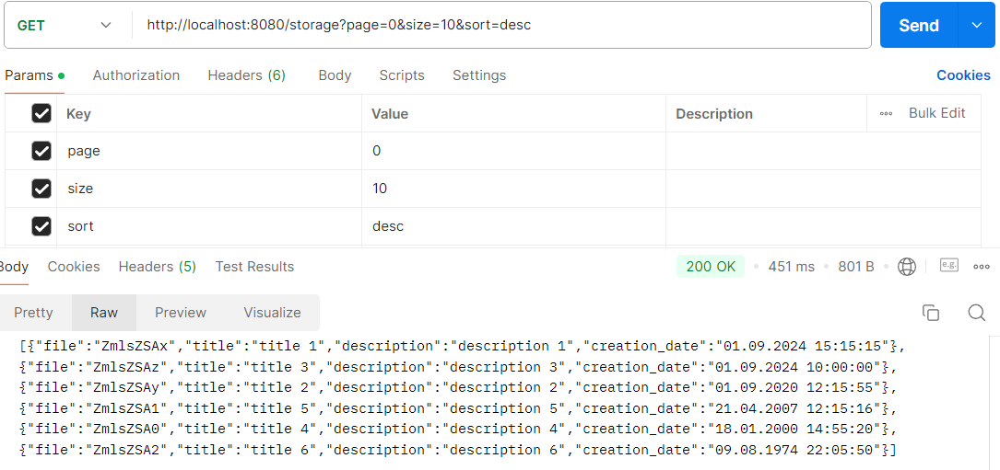
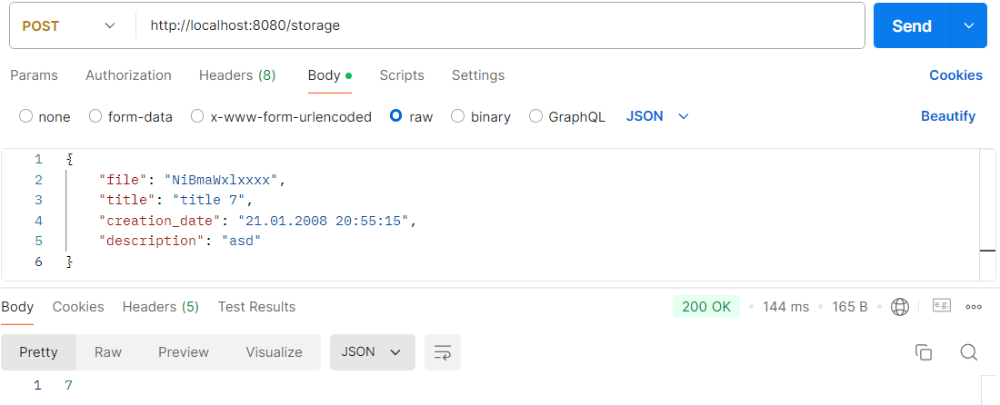
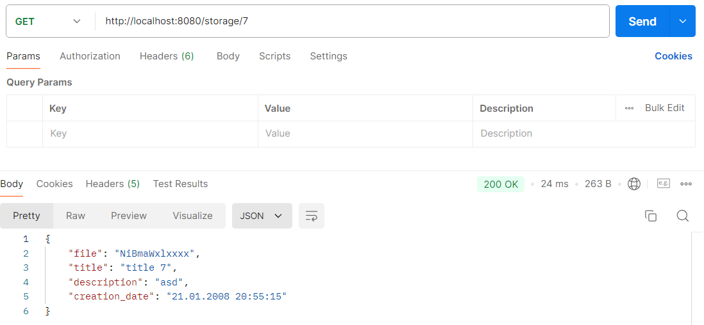

Приложение предоставляет 3 API-метода:
   1. Создание файла - POST-запрос по адресу http://localhost:8080/storage. В теле запроса передается JSON с содержимым и описанием файла.
   2. Получение файла по id - GET-запрос вида http://localhost:8080/storage/{id}.
   3. Получение списка всех файлов с пагинацией и сортировкой по дате дате создания - GET-запрос вида http://localhost:8080/storage?page=0&size=5&sort=desc, где параметры являются не обязательными (значения по умолчанию: page=0, size=10, sort=desc). Пагинация начинается с 0.

Пример файла в виде JSON:  
{ 
&nbsp;&nbsp;"file": "NiBmaWxl",  
&nbsp;&nbsp;"title": "title 7", 
&nbsp;&nbsp;"creation_date": "21.01.2008 20:55:15", 
&nbsp;&nbsp;"description": "asd" 
} 
В поле file вводится содержимое файла, закодированное в формате BASE64, дата вводится в формате dd.MM.yyyy HH.mm.ss

Для реализации были использованы стандартные методы Spring Data JPA, информация хранится в одной таблице, при этом само содержимое файлов хранится в виде массива байтов для уменьшения размера (т.е. при чтении/записи происходи декодировка/кодировка). Сервис и БД обернуты в отдельные docker-контейнеры.

Запуск приложения производится командой docker-compose up. При запуске инициализируется БД и вносятся 6 начальных записей.

Примеры запросов:

